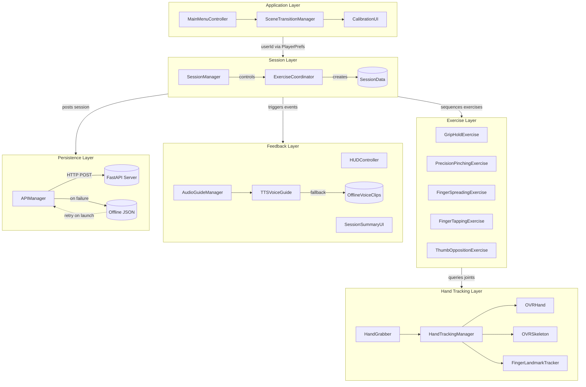
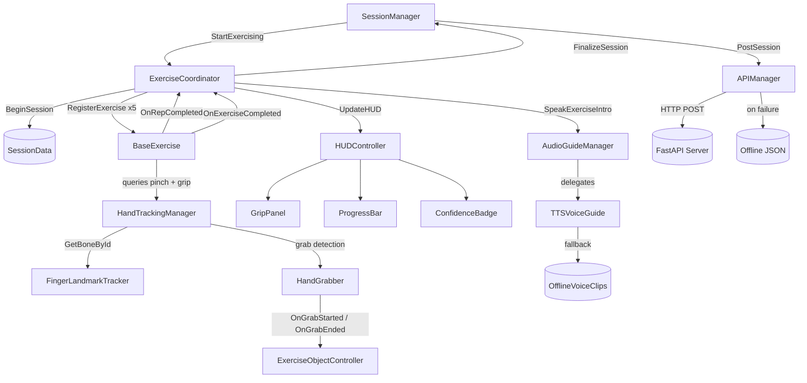
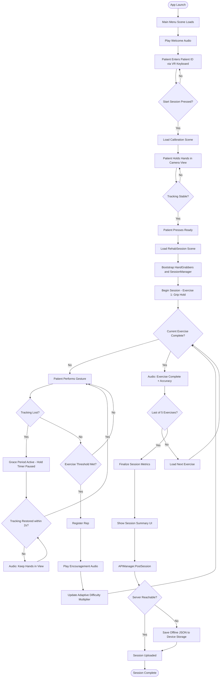
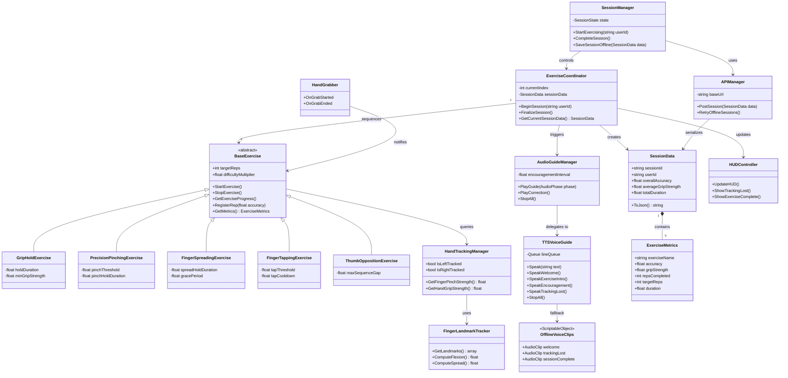
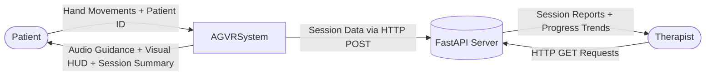
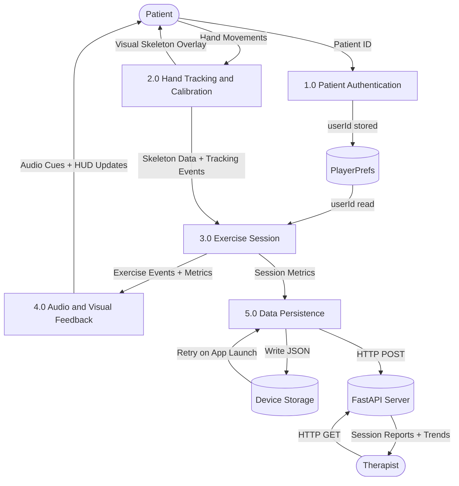
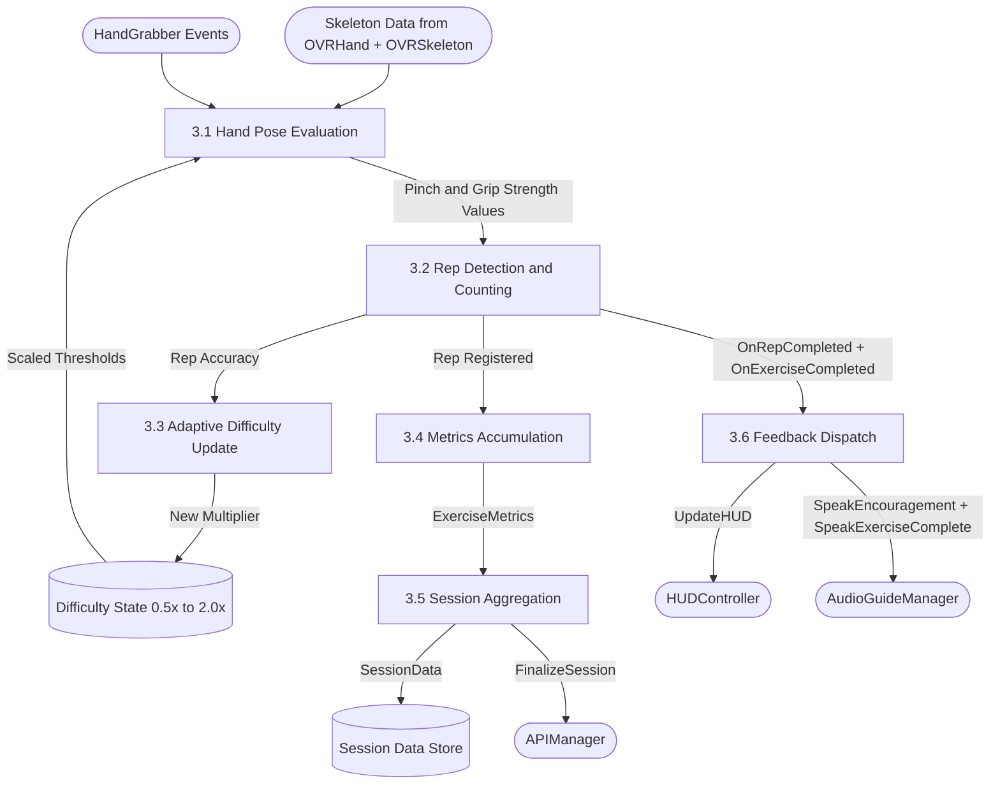

# Audio Guided Virtual Reality for Finger Motor Skill Rehabilitation

**Project:** AGVRSystem  
**Platform:** Meta Quest (VR Headset)  
**Engine:** Unity 6 (URP)  
**Author:** Kishan S

---

## Table of Contents

1. [Project Overview](#1-project-overview)
2. [Objectives](#2-objectives)
3. [Scope](#3-scope)
4. [Future Scope](#4-future-scope)
5. [Technology Stack](#5-technology-stack)
6. [Architectural Overview](#6-architectural-overview)
7. [Scene-by-Scene Breakdown](#7-scene-by-scene-breakdown)
8. [Data Flow](#8-data-flow)
9. [Exercise System Deep Dive](#9-exercise-system-deep-dive)
10. [Hand Tracking Implementation](#10-hand-tracking-implementation)
11. [Audio System](#11-audio-system)
12. [UI System](#12-ui-system)
13. [Networking & Persistence](#13-networking--persistence)
14. [Adaptive Difficulty System](#14-adaptive-difficulty-system)
15. [Performance Metrics & Evaluation](#15-performance-metrics--evaluation)
16. [Architectural Diagram](#16-architectural-diagram)
17. [Use Cases](#17-use-cases)
18. [Class Interaction Map](#18-class-interaction-map)
19. [Key Constants & Thresholds](#19-key-constants--thresholds)
20. [Known Limitations](#20-known-limitations)
21. [Activity Diagram](#21-activity-diagram)
22. [Class Diagram](#22-class-diagram)
23. [Data Flow — Level 0 (Context)](#23-data-flow--level-0-context)
24. [Data Flow — Level 1](#24-data-flow--level-1)
25. [Data Flow — Level 2 (Exercise Session)](#25-data-flow--level-2-exercise-session)

---

## 1. Project Overview

**Audio Guided Virtual Reality for Finger Motor Skill Rehabilitation** is a VR-based hand rehabilitation application that guides patients through structured hand and finger motor exercises using a Meta Quest headset. The system uses **markerless hand tracking** (no controllers required) to detect hand poses and gestures in real time, evaluate exercise performance, and record clinical metrics for therapist review.

The application targets patients recovering from:
- Stroke (motor function loss)
- Hand injuries (fractures, tendon repairs)
- Neurological conditions affecting fine motor skills
- Post-surgical rehabilitation

The patient wears the Meta Quest headset and performs a guided sequence of 5 exercises. The system provides real-time visual feedback via a HUD, audio instructions via voice guidance, and automatically uploads session data to a clinical server upon completion.

---

## 2. Objectives

### Primary Objectives
| # | Objective | How Achieved |
|---|-----------|-------------|
| 1 | Provide guided hand rehabilitation exercises in VR | 5 structured exercises with audio/visual guidance |
| 2 | Track hand movements without physical controllers | Meta XR SDK hand tracking (OVRHand, OVRSkeleton) |
| 3 | Evaluate exercise accuracy and performance | Per-exercise metrics: accuracy, grip strength, reps |
| 4 | Adapt difficulty to patient capability | Adaptive multiplier system (0.5x – 2.0x) |
| 5 | Record and transmit clinical session data | REST API upload + offline fallback storage |
| 6 | Provide audio-first accessibility | Voice guidance with offline pre-recorded clip fallback |

### Secondary Objectives
- Enable therapist oversight through server-side data review
- Provide visual hand skeleton feedback to patients
- Support both hands (bilateral tracking)
- Handle real-world constraints: tracking loss, network failure, scene transitions

---

## 3. Scope

### In Scope
- **5 Hand Exercises:** Grip Hold, Precision Pinching, Finger Spreading, Finger Tapping, Thumb Opposition
- **3 Application Scenes:** Main Menu, Calibration, Rehabilitation Session
- **Platform:** Meta Quest 2/3/Pro via Meta XR SDK v83
- **Hand Tracking:** Markerless, controller-free, bilateral
- **Metrics Collection:** Per-exercise and per-session performance data
- **Data Transmission:** HTTP REST API (local server at `localhost:8000`)
- **Audio Guidance:** Voice narration with procedural sound effects; offline pre-recorded clip fallback when TTS is unavailable
- **UI System:** World-space HUD, VR keyboard input, theme switching (dark/light)
- **Adaptive Difficulty:** Auto-scales based on last 3 rep accuracy

### Out of Scope
- Multiplayer / remote therapist live monitoring
- Wearable EMG/force sensor integration
- Custom exercise creation by therapists
- Leaderboards or gamification
- Haptic feedback (controllers not required)
- Web or mobile companion app

---

## 4. Future Scope

### Near-Term Enhancements
| Feature | Description | Impact |
|---------|-------------|--------|
| **Therapist Dashboard** | Web UI consuming the session API to visualize patient progress over time | High — enables clinical decision-making |
| **Haptic Feedback** | Integrate controller haptics or wearable vibrotactile devices for squeeze feedback | Medium — improves exercise realism |
| **Exercise Library Expansion** | Add wrist flexion/extension, opposition patterns, writing simulation | High — wider clinical use cases |
| **Patient Profiles** | Server-side patient accounts, session history, progress graphs | High — longitudinal tracking |
| **Biometric Integration** | Heart rate, EMG muscle activation via Bluetooth sensors | High — richer clinical data |

### Mid-Term Enhancements
| Feature | Description |
|---------|-------------|
| **Gamification** | Points, achievement badges, progress streaks to increase engagement |
| **Telerehabilitation** | Remote therapist can observe live session via streamed hand pose data |
| **Custom Protocols** | Therapists can prescribe specific exercise sets, durations, and difficulty floors |
| **Multi-Language Audio** | Support non-English patients via multilingual TTS or localized pre-recorded clips |
| **Eye Tracking** | Use Quest Pro eye tracking to detect focus/fatigue |
| **ElevenLabs TTS Integration** | Full integration of ElevenLabs TTS for natural-sounding voice guidance |

### Long-Term Vision
| Feature | Description |
|---------|-------------|
| **AI Exercise Coach** | LLM-driven real-time coaching using exercise metrics as context |
| **Biomechanical Modeling** | Map joint angles to clinical ROM (Range of Motion) measurements |
| **Hospital EMR Integration** | Push session reports directly to Electronic Medical Record systems |
| **Standalone Offline Mode** | Full operation without server (edge-case rural/disconnected clinics) |
| **Body Tracking** | Full upper-limb rehabilitation including elbow and shoulder |

---

## 5. Technology Stack

### Runtime
| Layer | Technology | Version |
|-------|-----------|---------|
| Game Engine | Unity | 6.x (URP) |
| Render Pipeline | Universal Render Pipeline (URP) | 17.0.4 |
| VR SDK | Meta XR SDK | 83.0.0 |
| Hand Tracking API | OVRHand / OVRSkeleton (Meta) | v83 |
| Hand Tracking Fallback | Unity XR Hands | 1.7.3 |
| XR Interaction | XR Interaction Toolkit | 3.3.0 |
| XR Runtime | OpenXR | 1.16.1 |
| Input System | Unity New Input System | 1.19.0 |
| Audio | Unity AudioSource + Procedural Tones | Built-in |
| TTS (intended) | ElevenLabs TTS | Cloud API (not fully integrated) |
| TTS (fallback) | Pre-recorded offline AudioClips | Local device storage |
| Networking | UnityWebRequest (REST) | Built-in |
| Serialization | Unity JsonUtility | Built-in |

### Development Tools
| Tool | Purpose |
|------|---------|
| ProBuilder | Level design, scene geometry |
| Unity Timeline | Animation sequences |
| Sketchfab For Unity | 3D asset import |
| MCP Server (ivanmurzak) | Claude Code integration for development |

### Backend
| Component | Technology |
|-----------|-----------|
| API Server | FastAPI (Python) — `http://localhost:8000` |
| Data Format | JSON (SessionData schema) |
| Offline Storage | `Application.persistentDataPath` (device filesystem) |
| Dashboard | Single-page HTML frontend served by FastAPI |

---

## 6. Architectural Overview

The application follows a **Manager-Coordinator-Exercise** layered architecture:

```
┌─────────────────────────────────────────────────────────────────┐
│                        APPLICATION LAYER                         │
│                                                                  │
│  MainMenuController  ──→  SceneTransitionManager  ──→  Calibration│
│         ↓                                                        │
│   PlayerPrefs (userId)                                           │
└─────────────────────────────────────────────────────────────────┘
                              ↓
┌─────────────────────────────────────────────────────────────────┐
│                         SESSION LAYER                            │
│                                                                  │
│  SessionManager (State Machine)                                  │
│  ┌──────────┬────────────┬────────────┬──────────┐             │
│  │  Idle    │Calibrating │Exercising  │ Complete │             │
│  └──────────┴────────────┴────────────┴──────────┘             │
│         ↕                    ↕                                   │
│  APIManager              ExerciseCoordinator                    │
│  SessionData             (sequences 5 exercises)                │
└─────────────────────────────────────────────────────────────────┘
                              ↓
┌─────────────────────────────────────────────────────────────────┐
│                        EXERCISE LAYER                            │
│                                                                  │
│  BaseExercise (abstract)                                         │
│  ├── GripHoldExercise                                            │
│  ├── PrecisionPinchingExercise                                   │
│  ├── FingerSpreadingExercise                                     │
│  ├── FingerTappingExercise                                       │
│  └── ThumbOppositionExercise                                     │
│                                                                  │
│  ExerciseObjectController  ←→  HandGrabber                      │
└─────────────────────────────────────────────────────────────────┘
                              ↓
┌─────────────────────────────────────────────────────────────────┐
│                      HAND TRACKING LAYER                         │
│                                                                  │
│  HandTrackingManager (Singleton per scene)                       │
│  ├── OVRHand (Left/Right)                                        │
│  ├── OVRSkeleton (21 bones per hand)                             │
│  ├── FingerLandmarkTracker (angle computation)                   │
│  └── HandTrackingFixer (SDK workarounds)                         │
│                                                                  │
│  HandJointVisualizer  ─→  Joint Spheres, Lines, Angle Labels    │
└─────────────────────────────────────────────────────────────────┘
                              ↓
┌─────────────────────────────────────────────────────────────────┐
│                       FEEDBACK LAYER                             │
│                                                                  │
│  HUDController (World-Space Canvas)                              │
│  AudioGuideManager ──→ TTSVoiceGuide                             │
│  ExerciseAudioCues                                               │
│  ProceduralToneGenerator                                         │
│  SessionSummaryUI                                                │
└─────────────────────────────────────────────────────────────────┘
                              ↓
┌─────────────────────────────────────────────────────────────────┐
│                       PERSISTENCE LAYER                          │
│                                                                  │
│  APIManager ──→ http://localhost:8000/api/session (POST)         │
│       ↓ (on failure)                                             │
│  Application.persistentDataPath (JSON files)                    │
│       ↓ (on app restart)                                         │
│  RetryOfflineSessions()                                          │
└─────────────────────────────────────────────────────────────────┘
```

### Design Patterns Used
| Pattern | Where Used |
|---------|-----------|
| **Singleton** | HandTrackingManager (per-scene) |
| **State Machine** | SessionManager (Idle/Calibrating/Exercising/Complete) |
| **Observer / Events** | Exercise events (OnRepCompleted, OnExerciseCompleted) |
| **Template Method** | BaseExercise — subclasses override evaluation logic |
| **Coordinator** | ExerciseCoordinator sequences exercises and aggregates data |
| **Bootstrapper** | RehabSessionStarter, HandTrackingBootstrapper — lazy init |
| **Offline-First** | APIManager with local queue fallback |

---

## 7. Scene-by-Scene Breakdown

### Scene 1: MainMenu.unity

**Purpose:** Application entry point. Patient identification and session start.

**Key GameObjects:**
- `MainMenuController` — Handles user ID input, theme toggle, start button
- `ThemeManager` — Manages Dark/Light UI theme state
- `TTSVoiceGuide` — Plays welcome audio on load
- `MainMenuEffects` / `MainMenuParticles` — Ambient visual effects
- `SceneTransitionManager` — Fade-to-black transition to Calibration

**Flow:**
```
Scene Load
    ↓ TTSVoiceGuide.SpeakWelcome()
    ↓ MainMenuController.OnEnable() — loads last userId from PlayerPrefs
    ↓ Patient enters ID via VRKeyboard / OculusKeyboardBridge
    ↓ Patient presses "Start Session"
    ↓ PlayerPrefs.SetString("LastUserId", id)
    ↓ SceneTransitionManager.LoadScene("Calibration")
```

**UI Elements:**
- Patient ID text field (VR keyboard input)
- Start button
- Theme toggle (dark/light)
- Welcome particle effects
- Background ambient audio

---

### Scene 2: Calibration.unity

**Purpose:** Hand tracking initialization and patient readiness check.

**Key GameObjects:**
- `CalibrationUI` — Step-by-step calibration wizard
- `HandJointVisualizer` — Shows joint spheres and skeleton overlay on hands
- `HandTrackingManager` — Initializes OVR hand references
- `HandTrackingFixer` — Applies SDK fixes (tracking origin, mesh rendering)
- `TrackedHandVisuals` (Left + Right) — OVRHand mesh renderers

**Flow:**
```
Scene Load
    ↓ HandTrackingFixer.FixTrackingOrigin()
    ↓ HandTrackingFixer.FixSkeletonRootPose()
    ↓ HandTrackingManager.RebindHandReferences()
    ↓ CalibrationUI shows "Hold hands in view" prompt
    ↓ HandJointVisualizer renders real-time skeleton with angle labels
    ↓ Patient sees their hands tracked in VR space
    ↓ Patient presses "Ready" or auto-advances when tracking is stable
    ↓ SceneTransitionManager.LoadScene("RehabSession")
```

**Visual Feedback:**
- Joint spheres (color-coded by tracking confidence)
- Bone lines connecting joints
- Floating angle labels for spread/flexion
- Confidence badge (Tracking OK / Tracking Lost)

---

### Scene 3: RehabSession.unity

**Purpose:** Main rehabilitation session — the core application experience.

**Key GameObjects:**
- `SessionManager` — Master state machine
- `ExerciseCoordinator` — Sequences all 5 exercises
- `RehabSessionStarter` — Bootstrap coroutine, ensures HandGrabbers exist
- 5 Exercise GameObjects (one per exercise type)
- `ExerciseObjectControllers` (5 objects) — Physical interaction targets
- `HUDController` — World-space HUD canvas
- `HandGrabber` (Left + Right) — Grab detection
- `FingerLandmarkTracker` — Bone position cache
- `AudioGuideManager` — Voice guidance orchestration
- `ExerciseAudioCues` — Per-exercise audio events
- `SessionSummaryUI` — End-of-session results
- `ReportBoard` — Physical report display object

**Scene Initialization Sequence:**
```
Scene Load (~3 frame delay via coroutine)
    ↓ RehabSessionStarter.EnsureHandGrabbers()
    ↓ RehabSessionStarter.TryAttachToSessionManager()
    ↓ SessionManager.SetState(Idle)
    ↓ RehabSessionStarter.StartExercising(userId)
    ↓ SessionManager.SetState(Exercising)
    ↓ ExerciseCoordinator.BeginSession(userId)
    ↓ Creates SessionData { sessionId=UUID, userId, startTimestamp }
    ↓ StartCurrentExercise(index=0) → GripHoldExercise
```

**Per-Frame Update Loop:**
```
ExerciseCoordinator.Update()
    ├── Current exercise evaluates hand pose
    ├── Rep counting logic fires
    ├── HUDController.UpdateHUD(state)
    ├── ExerciseObjectController updates progress bar
    └── AudioGuideManager triggers encouragement every 30s
```

**End of Session:**
```
All 5 exercises complete
    ↓ ExerciseCoordinator.FinalizeSession()
    ↓ SessionManager.CompleteSession()
    ↓ SessionSummaryUI.ShowSummary(sessionData)
    ↓ ReportBoard displays results
    ↓ APIManager.PostSession(sessionData)
        ├── Success: logs confirmation
        └── Failure: SessionManager.SaveSessionOffline(data)
```

---

## 8. Data Flow

### Complete Session Data Flow

```
┌────────────────────────────────────────────────────────────────────┐
│                     INPUT: Physical Hand Movements                  │
└─────────────────────┬──────────────────────────────────────────────┘
                       ↓
┌────────────────────────────────────────────────────────────────────┐
│               Meta XR SDK Layer                                     │
│  OVRHand → GetFingerPinchStrength(finger)  [pinch: 0.0–1.0]        │
│  OVRSkeleton → GetBoneById(id).Transform    [21 bone positions]     │
└─────────────────────┬──────────────────────────────────────────────┘
                       ↓
┌────────────────────────────────────────────────────────────────────┐
│               HandTrackingManager / FingerLandmarkTracker           │
│  GetFingerCurlGripStrength() → curl angle / 90° × 100              │
│  ComputeFlexion(boneA, boneB) → degrees                            │
│  ComputeSpread(fingerA, fingerB) → degrees                         │
│  GetLandmarks() → cached 21-point positions per hand               │
└─────────────────────┬──────────────────────────────────────────────┘
                       ↓
┌────────────────────────────────────────────────────────────────────┐
│               Exercise Evaluation (per frame)                       │
│  GripHoldExercise.Update()     → curl-based grip threshold         │
│  PrecisionPinchingExercise.Update() → pinch strength per finger    │
│  FingerSpreadingExercise.Update() → angle between finger pairs     │
│  FingerTappingExercise.Update() → index-thumb pinch count          │
│  ThumbOppositionExercise.Update() → thumb-to-each-finger sequence  │
└─────────────────────┬──────────────────────────────────────────────┘
                       ↓
┌────────────────────────────────────────────────────────────────────┐
│               Rep & Accuracy Accumulation                           │
│  BaseExercise.RegisterRep(accuracy)                                 │
│  → _accumulatedAccuracy += accuracy                                 │
│  → _repsCompleted++                                                 │
│  → AdaptiveDifficulty.Update(accuracy)                             │
│  → OnRepCompleted.Invoke(currentRep, accuracy)                     │
└─────────────────────┬──────────────────────────────────────────────┘
                       ↓
┌────────────────────────────────────────────────────────────────────┐
│               ExerciseCoordinator aggregation                       │
│  _metrics[index] = exercise.GetMetrics()                           │
│  → ExerciseMetrics { accuracy, gripStrength, reps, duration }      │
│  → OnExerciseCompleted → next exercise                              │
└─────────────────────┬──────────────────────────────────────────────┘
                       ↓
┌────────────────────────────────────────────────────────────────────┐
│               SessionData construction (on FinalizeSession)         │
│  SessionData {                                                       │
│    sessionId, userId,                                               │
│    startTimestamp, endTimestamp,                                    │
│    overallAccuracy, averageGripStrength, totalDuration,            │
│    exercises: ExerciseMetrics[5]                                    │
│  }                                                                  │
└─────────────────────┬──────────────────────────────────────────────┘
                       ↓
┌────────────────────────────────────────────────────────────────────┐
│               Output Paths (parallel)                               │
│  ┌─────────────────┐  ┌────────────────────┐  ┌────────────────┐  │
│  │ SessionSummaryUI│  │ APIManager.PostSes │  │ Offline JSON   │  │
│  │ (in-VR display) │  │ sion(data) HTTP    │  │ (fallback save)│  │
│  └─────────────────┘  └────────────────────┘  └────────────────┘  │
└────────────────────────────────────────────────────────────────────┘
```

### HUD Data Flow (Per-Frame)

```
ExerciseCoordinator.Update()
    → CurrentExercise.GetProgress() → [repsCompleted, targetReps, holdProgress, accuracy]
    → HandTrackingManager.GetHandGripStrength(Left) → leftGrip (0–100)
    → HandTrackingManager.GetHandGripStrength(Right) → rightGrip (0–100)
    → HUDController.UpdateHUD(state):
         Top bar: session timer | exercise name | rep counter | confidence badge
         Center: left grip meter | exercise instruction | right grip meter
         Bottom: hold progress bar | accuracy bar

GripPanel.SetGripStrength(leftGrip)
    → Fills gauge from bottom (0%) to top (100%)
    → Color: green > 60%, yellow 30-60%, red < 30%
```

---

## 9. Exercise System Deep Dive

### Inheritance Hierarchy

```
MonoBehaviour
    └── BaseExercise (abstract)
            ├── GripHoldExercise
            ├── PrecisionPinchingExercise
            ├── FingerSpreadingExercise
            ├── FingerTappingExercise
            └── ThumbOppositionExercise
```

### BaseExercise — Abstract Base

**Responsibilities:**
- Rep counter and target rep management
- Accuracy accumulation and averaging
- Adaptive difficulty multiplier
- Events: `OnRepCompleted`, `OnExerciseCompleted`
- Abstract methods: `StartExercise()`, `StopExercise()`, `GetExerciseProgress()`

**Adaptive Difficulty Logic:**
```
Rolling window: last 3 reps accuracy values
If all 3 > 85%:  DifficultyMultiplier = min(2.0, multiplier + 0.1)
If all 3 < 50%:  DifficultyMultiplier = max(0.5, multiplier - 0.1)
Otherwise: no change
```

---

### Exercise 1: GripHoldExercise

| Property | Value |
|----------|-------|
| Target | Hand grip strength and sustained hold |
| Mechanism | Curl-based grip (MCP→PIP joint angles) |
| Hold Duration | 3.0s × DifficultyMultiplier |
| Target Reps | 5 |
| Min Grip Threshold | 0.3 (30%) |
| Accuracy Formula | `successfulGrabs / totalAttempts` |

**Detection Flow:**
```
HandGrabber.OnGrabStarted → BeginHold()
    ↓ Per frame: GetFingerCurlGripStrength() ≥ _minGripStrength
    ↓ Hold timer increments
    ↓ If hold timer ≥ holdDuration AND grip maintained → RegisterRep()
    ↓ Grace period (0.5s): if tracking lost, continue hold timer
    ↓ HandGrabber.OnGrabEnded → interrupt hold if grip dropped
```

---

### Exercise 2: PrecisionPinchingExercise

| Property | Value |
|----------|-------|
| Target | Fine motor control — finger-by-finger pinch |
| Mechanism | OVRHand.GetFingerPinchStrength() per finger |
| Hold Duration | 1.5s per finger × DifficultyMultiplier |
| Target Reps | 12 (4 fingers × 3 cycles) |
| Pinch Threshold | 0.8 (80%) |
| Accuracy Formula | Average pinch strength across all held pinches |

**Detection Flow:**
```
Sequence: Index → Middle → Ring → Pinky
Per finger:
    ↓ PinchStrength(finger) ≥ _pinchThreshold (scaled by difficulty)
    ↓ Hold timer increments
    ↓ Check isolation: no adjacent fingers also pinching
    ↓ If hold timer ≥ holdDuration → advance to next finger
    ↓ After all 4 fingers → 1 rep completed
    ↓ Bilateral: either Left or Right hand accepted
```

---

### Exercise 3: FingerSpreadingExercise

| Property | Value |
|----------|-------|
| Target | Finger spreading range of motion |
| Mechanism | Bone-based angle measurement between finger pairs |
| Hold Duration | 2.0s |
| Target Reps | 8 |
| Per-Pair Thresholds | Index-Middle: 10°, Middle-Ring: 7°, Ring-Pinky: 8°, Thumb-Index: 20° |
| Accuracy Formula | Bilateral symmetry score: `1 - abs(leftAvg - rightAvg) / 90°` |

**Detection Flow:**
```
Per frame, for each finger pair (4 pairs):
    ↓ Prefer OVRSkeleton bone positions
    ↓ Fallback: low pinch strength = spread detected
    ↓ Compute angle between pair using Vector3.Angle()
    ↓ Grace period (0.3s): filters tracking jitter
    ↓ If all 4 pairs spread ≥ thresholds for holdDuration → rep
    ↓ Score bilateral symmetry across left and right hands
```

---

### Exercise 4: FingerTappingExercise

| Property | Value |
|----------|-------|
| Target | Finger dexterity and tap speed |
| Mechanism | Index-thumb pinch with cooldown |
| Tap Threshold | 0.85 |
| Release Threshold | 0.35 (hysteresis) |
| Cooldown | 0.3s per tap |
| Target Reps | 20 taps |
| Accuracy Formula | `tapsCompleted / targetTaps` |

**Detection Flow:**
```
Per frame:
    ↓ IndexFingerPinchStrength ≥ 0.85
    ↓ Not in cooldown
    ↓ Register tap, start cooldown timer
    ↓ Wait for release (pinch < 0.35) before next tap possible
    ↓ Each tap = 1 rep toward 20 target
```

---

### Exercise 5: ThumbOppositionExercise

| Property | Value |
|----------|-------|
| Target | Thumb coordination and opposition sequence |
| Mechanism | Thumb-to-each-finger sequential pinch |
| Sequence | Index → Middle → Ring → Pinky |
| Gap Tolerance | 2.0s max between touches |
| Target Reps | 6 full sequences |
| Accuracy Formula | `1 - (totalGapTime / maxPossibleGapTime)` (timing accuracy) |

**Detection Flow:**
```
Per sequence (1 rep):
    ↓ Thumb-Index pinch ≥ threshold[Index] → touch registered
    ↓ Release detected (< 50% of threshold)
    ↓ Thumb-Middle pinch ≥ threshold[Middle] → touch registered
    ↓ Release → Thumb-Ring → Release → Thumb-Pinky
    ↓ If gap between touches > 2.0s → sequence broken, restart
    ↓ All 4 touches in sequence → RegisterRep(timingAccuracy)
    ↓ DifficultyMultiplier scales per-finger thresholds
```

---

## 10. Hand Tracking Implementation

### SDK Layers

```
Physical Hands
    ↓ Meta Quest camera array (hand vision)
Meta XR SDK v83
    ├── OVRHand (per hand)
    │       GetFingerPinchStrength(OVRHand.HandFinger)  [0-1]
    │       IsTracked → bool
    │       TrackingConfidence → Low/High
    ├── OVRSkeleton (per hand)
    │       GetBoneById(BoneId) → Transform (21 bones)
    │       IsInitialized → bool
    └── OVRMesh + OVRMeshRenderer → rendered hand mesh
XR Hands v1.7 (fallback)
    └── XRHandLeft / XRHandRight → XRHandJoint positions
```

### 21-Bone Skeleton

```
WristRoot (0)
├── Thumb CMC (1) → Thumb MCP (2) → Thumb IP (3) → Thumb Tip (4)
├── Index MCP (5) → Index PIP (6) → Index DIP (7) → Index Tip (8)
├── Middle MCP (9) → Middle PIP (10) → Middle DIP (11) → Middle Tip (12)
├── Ring MCP (13) → Ring PIP (14) → Ring DIP (15) → Ring Tip (16)
└── Pinky MCP (17) → Pinky PIP (18) → Pinky DIP (19) → Pinky Tip (20)
```

### Grip Strength Calculation

```csharp
// Curl-based grip (more accurate than pinch for "gripping")
float avgCurl = 0;
for each finger (Index, Middle, Ring, Pinky):
    Vector3 mcpPos = skeleton.GetBoneById(MCP).position
    Vector3 pipPos = skeleton.GetBoneById(PIP).position
    float angle = Vector3.Angle(mcpPos - wrist, pipPos - mcpPos)
    avgCurl += angle
avgCurl /= 4
gripStrength = avgCurl / 90f * 100f  // 0-100 scale
```

### HandGrabber Dual Detection

```
Pinch Grab:
    midpoint = (thumbTip + indexTip) / 2
    if distance(midpoint, objectCenter) < 6cm → grab initiated

Palm Grab:
    fingerTips = [thumb, index, middle, ring, pinky] tip positions
    weightedCenter = average(fingerTips)
    engagedCount = fingers within 8cm of object
    if engagedCount ≥ 3 → grab initiated

Sticky Grab Prevention:
    - Release uses same detection type as initiation
    - Pinch release: midpoint distance > 8cm (larger hysteresis zone)
    - Palm release: engagedCount drops below 2
```

### Tracking Loss Handling

```
OVRHand.IsTracked == false:
    → HUDController shows "Tracking Lost" warning badge
    → AudioGuideManager queues "Please keep your hands visible" prompt
    → GripHoldExercise: grace period timer (0.5s) before hold interrupted
    → FingerSpreadingExercise: grace period (0.3s) before spread interrupted
    → HandJointVisualizer: hides visuals, shows "lost" color
```

---

## 11. Audio System

### Architecture

The audio system is designed to be fully functional without internet connectivity. Voice guidance is delivered through a priority queue system using pre-recorded offline clips. A TTS agent integration point exists for future live speech synthesis.

```
AudioGuideManager (orchestrator)
    ├── TTSVoiceGuide (voice guidance)
    │       ├── TTS Agent (reflection-based, requires compatible agent in scene)
    │       │       └── ElevenLabs TTS (intended — not fully integrated)
    │       └── OfflineVoiceClips (pre-recorded AudioClip fallback — primary path)
    ├── ExerciseAudioCues (exercise event audio)
    └── UIAudioFeedback (UI interactions)

ProceduralToneGenerator (runtime audio synthesis)
    ├── Grab ding: 400Hz sine (ball) / 600Hz (cylinder)
    ├── Squeeze tone: volume scales with grip intensity
    └── Success beep: rising two-tone

SpatialAudioController
    └── Positions AudioSources in 3D relative to hands
```

### TTS Integration Status

The `TTSVoiceGuide` component uses **C# reflection** at runtime to find a TTS agent component in the scene, searching for types containing "TextToSpeech", "TTSAgent", or "SpeechSynthesis" in their name. It then calls `SpeakText()` or `Speak()` methods via reflection.

**ElevenLabs TTS** was intended as the cloud voice provider, but the integration is not currently working. The reflection-based approach requires the ElevenLabs component to expose specific method names that may differ from the current reflection lookup. Until the TTS agent is properly bound, the system automatically falls back to:

- **OfflineVoiceClips** — a `ScriptableObject` containing pre-recorded `AudioClip` assets for all voice lines (welcome, calibration, exercise intros, encouragement, session complete, tracking lost, etc.)

The `AudioSystemBootstrapper` loads `OfflineVoiceClips.asset` from `Assets/Resources/` before any scene loads, ensuring audio guidance is always available regardless of network state or TTS status.

### TTS Priority Queue

```
Priority levels:
    CRITICAL (0): Tracking lost warnings
    HIGH (1):     Exercise start/complete instructions
    MEDIUM (2):   Rep encouragement ("Great job!")
    LOW (3):      Background ambient narration

Queue behavior:
    - Higher priority interrupts lower priority
    - Same priority: queue and play sequentially
    - Encouragement cooldown: 30s minimum interval
```

### Audio Event Map

| Event | Audio Response |
|-------|---------------|
| Session start | Welcome + exercise sequence overview |
| Exercise start | Exercise name + instructions |
| Rep completed | Positive reinforcement (varied) |
| Exercise completed | Completion sound + accuracy spoken |
| Tracking lost | Warning prompt to hold hands in view |
| Session complete | Celebration + overall accuracy spoken |
| UI click | Short click SFX |
| Error state | Error tone |

---

## 12. UI System

### HUD Layout (World-Space Canvas)

```
┌────────────────────────────────────────────────────────┐
│  [Timer: 02:34]  [Exercise 2/5: Precision Pinching]    │
│                                      [Tracking: OK ✓]  │
├────────────────────────────────────────────────────────┤
│  LEFT GRIP           INSTRUCTION          RIGHT GRIP   │
│  ████████░░          "Pinch your          ██████░░░░   │
│  78%                  index finger"       62%          │
├────────────────────────────────────────────────────────┤
│  Hold Progress: ████████████░░░░  [Rep 3 / 12]         │
│  Accuracy:      ████████████████  [92%]                │
└────────────────────────────────────────────────────────┘
```

### UI Components

| Component | Description |
|-----------|-------------|
| `HUDController` | Master controller for the world-space HUD canvas |
| `GripPanel` | Real-time grip strength meter (0-100%) with color coding |
| `ProgressBar` | Filled progress bar with animated transitions |
| `ConfidenceBadge` | Green/red tracking state indicator |
| `ExerciseInfoPanel` | Exercise name, rep count, instructions |
| `FingerSpreadAngleOverlay` | Live angle display for 4 finger pairs |
| `CanvasHandRenderer` | 2D hand silhouette on UI (non-VR view) |
| `SessionSummaryUI` | Post-session results: accuracy, reps, grip strength |

### Theme System

```
ThemeManager
    ├── ThemeData (dark): dark backgrounds, bright accent colors
    ├── ThemeData (light): light backgrounds, muted accents
    └── ThemeApplier (on each UI object): subscribes to ThemeManager.OnThemeChanged
             ↓ applies Color, Sprite, Material per theme spec
```

### VR Input

```
Text Input Path:
    VRKeyboard (floating keyboard prefab) → string callback → text field

Meta Quest Keyboard Path:
    OculusKeyboardBridge → Meta's native Quest keyboard API → string callback

Both paths → MainMenuController.SetUserId(string)
```

---

## 13. Networking & Persistence

### Backend

The backend is a **FastAPI** (Python) server that:
- Receives session data from the Unity VR app via HTTP POST
- Stores sessions as JSON files on disk
- Exposes REST endpoints for the web dashboard
- Serves a single-page HTML dashboard frontend

**Run the server:**
```bash
cd server
pip install -r requirements.txt
python main.py
```
Server starts at `http://localhost:8000`.

### REST API Schema

**Endpoint:** `POST http://localhost:8000/api/session`

**Request Body:**
```json
{
  "sessionId": "550e8400-e29b-41d4-a716-446655440000",
  "patientId": "Patient123",
  "startTimestamp": "2026-04-17T10:30:00.0000000Z",
  "endTimestamp": "2026-04-17T10:35:45.0000000Z",
  "overallAccuracy": 87.5,
  "averageGripStrength": 65.3,
  "totalDuration": 345.2,
  "exercises": [
    {
      "exerciseName": "GripHoldExercise",
      "accuracy": 92.0,
      "gripStrength": 68.5,
      "repsCompleted": 5,
      "targetReps": 5,
      "duration": 67.3,
      "startTimestamp": "2026-04-17T10:30:00Z",
      "endTimestamp": "2026-04-17T10:31:07Z"
    },
    { "exerciseName": "PrecisionPinchingExercise", "...": "..." },
    { "exerciseName": "FingerSpreadingExercise",   "...": "..." },
    { "exerciseName": "FingerTappingExercise",     "...": "..." },
    { "exerciseName": "ThumbOppositionExercise",   "...": "..." }
  ]
}
```

**Other Endpoints:**
| Method | Endpoint | Description |
|--------|----------|-------------|
| GET | `/api/sessions` | List all session summaries |
| GET | `/api/session/{id}` | Get full session data by ID |
| GET | `/api/improvement` | Accuracy/grip trend data for charts |
| GET | `/api/stats` | Aggregate statistics across all sessions |
| GET | `/` | Serve the HTML dashboard frontend |

### Offline Sync Strategy

```
During Session:
    SessionManager.AutosaveTimer (30s interval)
        → JsonUtility.ToJson(sessionData)
        → File.WriteAllText(persistentDataPath/session_<id>.json, json)

On APIManager.PostSession() failure:
    → SaveSessionOffline(sessionData)
    → Marks file with "offline_" prefix

On App Start (RehabSessionStarter):
    → APIManager.RetryOfflineSessions()
    → Scans persistentDataPath for "offline_*.json"
    → Re-attempts HTTP POST for each
    → On success: delete local file
    → On failure: leave for next startup
```

---

## 14. Adaptive Difficulty System

```
┌─────────────────────────────────────────────────────┐
│                  Per-Exercise Difficulty             │
│                                                     │
│  DifficultyMultiplier: 1.0 (start)                 │
│  Range: 0.5 (easier) ←────────────→ 2.0 (harder)  │
│                                                     │
│  Rolling window: last 3 reps                        │
│  ┌──────────────────────────────────────────────┐  │
│  │ All 3 > 85% → +0.1 (cap at 2.0)             │  │
│  │ All 3 < 50% → -0.1 (floor at 0.5)           │  │
│  │ Mixed       → no change                      │  │
│  └──────────────────────────────────────────────┘  │
└─────────────────────────────────────────────────────┘
           ↓ Applied per exercise:
┌──────────────────────────────────────────────────────┐
│ GripHold:   holdDuration = 3.0s × multiplier         │
│ Pinching:   pinchThreshold = 0.8 × multiplier        │
│ Opposition: fingerThresholds[] × multiplier          │
│ Spreading:  (thresholds fixed — not scaled)          │
│ Tapping:    (tap count fixed — not scaled)           │
└──────────────────────────────────────────────────────┘
```

---

## 15. Performance Metrics & Evaluation

### Per-Exercise Metrics (ExerciseMetrics)

| Field | Type | Description |
|-------|------|-------------|
| `exerciseName` | string | Class name (e.g., "GripHoldExercise") |
| `accuracy` | float | 0–100% exercise-specific score |
| `gripStrength` | float | 0–100% average curl-based grip |
| `repsCompleted` | int | Actual reps done |
| `targetReps` | int | Prescribed rep count |
| `duration` | float | Seconds taken for exercise |
| `startTimestamp` | string | ISO 8601 UTC |
| `endTimestamp` | string | ISO 8601 UTC |

### Accuracy Calculation Per Exercise

| Exercise | Formula |
|----------|---------|
| GripHold | `successfulGrabs / totalAttempts` |
| PrecisionPinching | `avgPinchStrength` at moment of hold completion |
| FingerSpreading | `1 - abs(leftSpreadAvg - rightSpreadAvg) / 90°` (bilateral symmetry) |
| FingerTapping | `tapsCompleted / targetTaps` |
| ThumbOpposition | `1 - (totalGapTime / maxPossibleGapTime)` |

### Session-Level Aggregation

```
overallAccuracy      = average(exercise[i].accuracy)     for all 5
averageGripStrength  = average(exercise[i].gripStrength)  for all 5
totalDuration        = sum(exercise[i].duration)          for all 5
```

---

## 16. Architectural Diagram



---

## 17. Use Cases

### UC-01: Patient Starts a Rehabilitation Session

**Actor:** Patient  
**Precondition:** Meta Quest headset powered on, app launched  
**Main Flow:**
1. Patient sees Main Menu in VR
2. Patient uses VR keyboard to enter their Patient ID
3. Patient presses "Start Session" button
4. System transitions to Calibration scene
5. Patient holds hands visible in headset camera view
6. System displays tracked hand skeleton overlay
7. When tracking confirmed stable, patient presses "Ready"
8. System transitions to RehabSession scene
9. Audio narration welcomes patient and describes exercise sequence
10. Session begins with Exercise 1 (Grip Hold)

**Postcondition:** Session data recording begins, first exercise active

---

### UC-02: Patient Completes a Single Exercise

**Actor:** Patient  
**Precondition:** RehabSession scene active, exercise in progress  
**Main Flow:**
1. HUD displays exercise name, rep target, and instructions
2. Audio guide narrates the exercise technique
3. Patient performs gesture (e.g., grips virtual ball)
4. ExerciseObjectController shows progress bar on object
5. Hold timer fills on HUD bottom bar
6. Rep registered; audio plays encouragement
7. After reaching target reps, exercise auto-advances
8. HUD shows brief "Exercise Complete! Accuracy: 92%" message
9. Audio narrates exercise result
10. Next exercise begins after 2-second pause

**Alternate Flow (Tracking Lost):**
1. Hand disappears from camera view
2. HUD shows "Tracking Lost" badge in red
3. Hold timer pauses (grace period active)
4. Audio plays "Please keep your hands visible"
5. When tracking resumes, exercise continues from paused state

---

### UC-03: Session Completes and Data Uploads

**Actor:** System  
**Precondition:** All 5 exercises completed  
**Main Flow:**
1. ExerciseCoordinator finalizes session
2. SessionSummaryUI appears with per-exercise breakdown
3. ReportBoard displays in VR space with results
4. APIManager sends POST to `http://localhost:8000/api/session`
5. Server returns 201 Created
6. Session marked complete

**Alternate Flow (Network Unavailable):**
1. APIManager POST fails (timeout / connection refused)
2. SessionManager saves JSON to device storage
3. SummaryUI still shows results correctly
4. On next app launch, RetryOfflineSessions() re-attempts upload

---

### UC-04: Therapist Reviews Session Data (External System)

**Actor:** Clinical Therapist  
**Precondition:** Session data uploaded to server  
**Main Flow:**
1. Therapist opens web dashboard at `http://localhost:8000`
2. Therapist searches by Patient ID
3. Server returns historical session list
4. Therapist selects session to view details
5. Per-exercise accuracy, grip strength, duration displayed
6. Therapist compares trends across sessions
7. Therapist adjusts prescribed exercise protocol

---

### UC-05: Adaptive Difficulty Adjusts During Session

**Actor:** System  
**Precondition:** Patient in exercise, ≥3 reps completed  
**Main Flow:**
1. Patient completes rep with accuracy > 85%
2. System logs accuracy in rolling 3-rep window
3. All 3 recent reps > 85%
4. DifficultyMultiplier increases by 0.1
5. Next GripHold: holdDuration increases from 3.0s to 3.3s
6. Patient must sustain grip longer for credit
7. (If accuracy falls < 50%): multiplier decreases, making exercises easier

---

### UC-06: Patient Performs Finger Tapping Exercise

**Actor:** Patient  
**Precondition:** FingerTappingExercise is the current exercise  
**Main Flow:**
1. HUD shows "Tap your index finger to thumb — 20 taps"
2. Audio narrates tapping technique
3. Patient repeatedly pinches index finger to thumb
4. Each pinch strength > 85%: tap registered, counter increments
5. 0.3s cooldown prevents double-counting
6. Cooldown sound (beep) confirms each tap
7. Rep counter on HUD increments each tap
8. At 20 taps: exercise completes, audio celebrates

---

## 18. Class Interaction Map



---

## 19. Key Constants & Thresholds

| Constant | Value | Component | Description |
|----------|-------|-----------|-------------|
| `MaxCurlAngle` | 90° | HandTrackingManager | Max finger flexion angle for normalization |
| `MinGripStrength` | 0.3 | GripHoldExercise | Minimum curl-based grip to count hold |
| `HoldDuration` | 3.0s | GripHoldExercise | Required hold time (scaled by difficulty) |
| `PinchThreshold` | 0.8 | PrecisionPinchingExercise | Minimum pinch strength per finger |
| `PinchHoldDuration` | 1.5s | PrecisionPinchingExercise | Hold time per finger |
| `IndexMiddleAngle` | 10° | FingerSpreadingExercise | Minimum spread angle for index-middle pair |
| `MiddleRingAngle` | 7° | FingerSpreadingExercise | Minimum spread angle for middle-ring pair |
| `RingPinkyAngle` | 8° | FingerSpreadingExercise | Minimum spread angle for ring-pinky pair |
| `ThumbIndexAngle` | 20° | FingerSpreadingExercise | Minimum spread angle for thumb-index pair |
| `SpreadHoldDuration` | 2.0s | FingerSpreadingExercise | Hold time for spread position |
| `SpreadGracePeriod` | 0.3s | FingerSpreadingExercise | Tracking jitter tolerance |
| `TapPinchThreshold` | 0.85 | FingerTappingExercise | Pinch strength to register tap |
| `TapReleaseThreshold` | 0.35 | FingerTappingExercise | Hysteresis release threshold |
| `TapCooldown` | 0.3s | FingerTappingExercise | Minimum time between taps |
| `MaxSequenceGap` | 2.0s | ThumbOppositionExercise | Max allowed time between sequence touches |
| `HoldGracePeriod` | 0.5s | GripHoldExercise | Tracking loss tolerance |
| `MaxGrabDistance` | 0.15m | HandGrabber | Force-release if hand moves away |
| `FollowTightness` | 0.85 | HandGrabber | Object-to-hand smoothing factor |
| `AutosaveInterval` | 30s | SessionManager | Session data autosave frequency |
| `EncouragementInterval` | 30s | AudioGuideManager | Minimum time between voice encouragements |
| `DifficultyMin` | 0.5 | BaseExercise | Easiest difficulty multiplier |
| `DifficultyMax` | 2.0 | BaseExercise | Hardest difficulty multiplier |
| `DifficultyStep` | 0.1 | BaseExercise | Multiplier adjustment per evaluation |

---

## 20. Known Limitations

| # | Limitation | Workaround / Notes |
|---|-----------|-------------------|
| 1 | **Fixed exercise order** | Always: GripHold → Pinching → Spreading → Tapping → Opposition. No customization. |
| 2 | **Single-user only** | No multiplayer, remote monitoring, or co-present therapist |
| 3 | **Local API server only** | `http://localhost:8000` — not suitable for cloud deployment without config change |
| 4 | **No haptic feedback** | Controller-free hand tracking means no vibration feedback |
| 5 | **Binary tracking state** | No confidence gradation — only tracked/not tracked |
| 6 | **No hand mesh morphing** | Objects don't physically deform around hand geometry |
| 7 | **No leaderboard** | Performance data sent to server but no in-app ranking or comparison |
| 8 | **Scene-scoped singletons** | HandTrackingManager re-initializes per scene (not DontDestroyOnLoad) |
| 9 | **ElevenLabs TTS not working** | TTS reflection binding does not match ElevenLabs SDK API. System falls back to pre-recorded offline `AudioClip` assets, which must be manually assigned to `OfflineVoiceClips.asset`. |
| 10 | **Fixed exercise difficulty floor** | 0.5x minimum means exercises can still be challenging for severe cases |
| 11 | **OfflineVoiceClips must be populated** | Audio clips for all voice lines must be pre-recorded and assigned in the `OfflineVoiceClips` ScriptableObject at `Assets/Resources/OfflineVoiceClips.asset`. Missing clips result in silent guidance. |

---

## 21. Activity Diagram

The following diagram shows the complete patient workflow from app launch through session completion, including all decision points and audio feedback triggers.



---

## 22. Class Diagram

UML class diagram showing the key classes, their attributes, methods, and relationships.



---

## 23. Data Flow — Level 0 (Context)

The context diagram shows the entire system as a single process, with its two external entities (Patient and Therapist) and the top-level data flows.



---

## 24. Data Flow — Level 1

Level 1 decomposes the system into five major processes, showing how data moves between them, their data stores, and the external entities.



---

## 25. Data Flow — Level 2 (Exercise Session)

Level 2 drills down into Process 3.0 (Exercise Session), showing the internal sub-processes that evaluate hand poses, count reps, adapt difficulty, accumulate metrics, and dispatch feedback.



---

## Summary

**Audio Guided Virtual Reality for Finger Motor Skill Rehabilitation** is a clinically-oriented VR rehabilitation application with:

- **5 physiotherapy exercises** targeting hand grip, pinch, spread, tapping, and thumb coordination
- **Markerless hand tracking** using Meta XR SDK v83 with bilateral support
- **Audio-first UX** using pre-recorded voice clips (offline), procedural sound effects, and spatial audio. ElevenLabs TTS integration is intended but not yet functional; audio runs fully offline via `OfflineVoiceClips`
- **Adaptive difficulty** that auto-scales based on patient performance
- **Comprehensive metrics** collection with FastAPI REST upload and offline fallback
- **Event-driven architecture** with clean separation: tracking → exercises → HUD → audio → persistence
- **World-space HUD** providing real-time grip meters, rep counters, hold timers, and tracking status
- **FastAPI backend** with session storage, improvement trend API, and a web dashboard frontend

The system is architected for clinical deployment with enterprise-level error handling (tracking loss grace periods, offline sync, scene-transition resilience) and is well-positioned for expansion into a full telerehabilitation platform.
